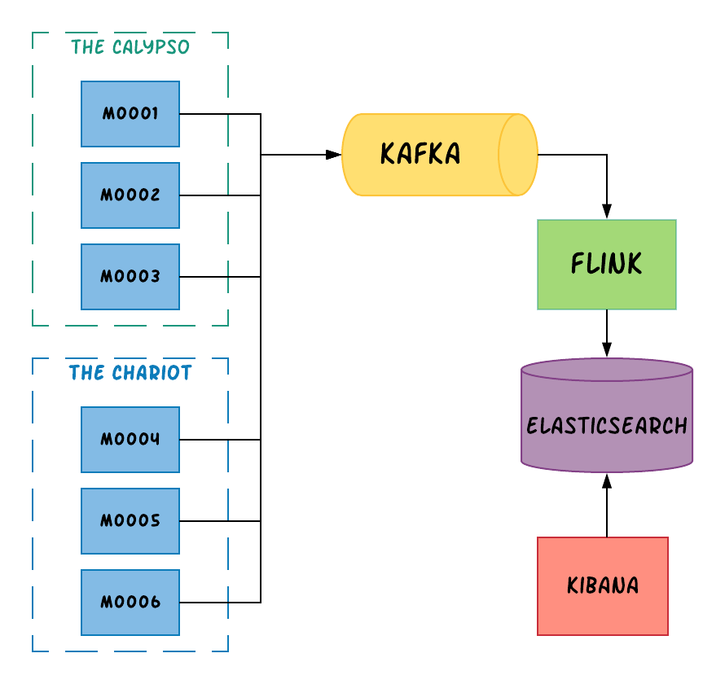

# Apache Flink - Casino Streaming

This project is an exemplary Apache Flink application, witch presents stream processing in casino.

## Prerequisites

* Maven
* Docker compose
* Flink 1.6+

## Overview

This repository allows you to run an example casino stream processing on Flink's cluster. Architecture:



* **Casino sites** - an area that gathers several machines. Example: ``The Calypso``, ``The Chariot``
* **Machines** - physical machines that plays casino games. All machines sends events to the Kafka queue. Example: ``M0001``, ``M0002``, etc.
* **Kafka** - message queue
* **Flink** - stream processing engine
* **Elasticsearch** - storage for processed events
* **Kibana** - data visualization

## Running locally

There is prepared the ``docker-compose.yaml`` file which allows you to run the following services:

* ``Elasticsearch`` - storage for processed events (sink)
* ``Kibana`` - data visualization
* ``Kafka`` - message queue
* ``Zookeeper`` - configuration service for Kafka

To run all services, execute the following command:

```bash
docker-compose up -d
```

To crate all necessary java libraries (Flink's job and casino simulation), execute the following command:

```bash
mvn package
```

To run Flink's local cluster, execute the following command in Flink's bin directory:

```bash
start-cluster
```

To deploy job, run the following command:

```bash
flink run -d core\target\casino-streaming-core-1.0-SNAPSHOT.jar
```

To run casino simulation, execute the following command:

```bash
java -jar simulation/target/casino-streaming-simulation-1.0-SNAPSHOT.jar
```

Finally, go to the [Kibana page](http://localhost:5601), open the ``Dashboard`` menu, click add a new dashboard, 
click add panel button and select all ``visualisations`` and ``saved searches``.